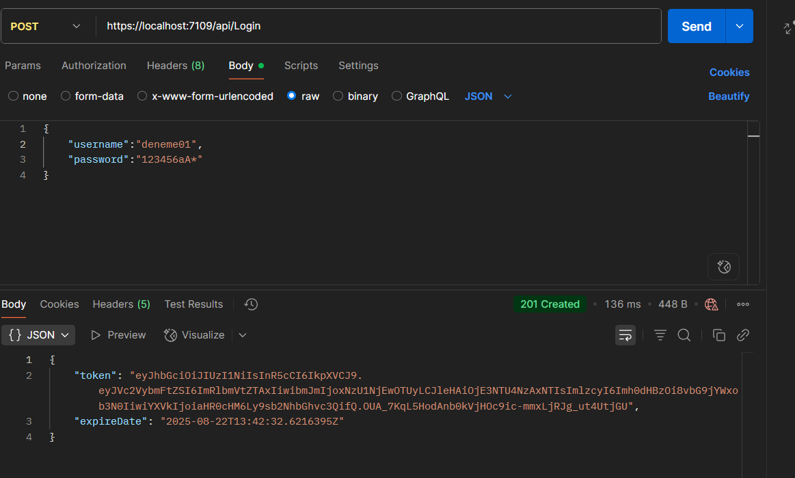

  <h2>Proje çalıştırmadan önce bilgisayarınızda yüklü olması gerekenler</h2>
  <ul>
    <li>Docker</li>
    <li>PostgreSql</li>
    <li>Visual Studio</li>
  </ul>
  <h3>Docker Ayarları</h3>
  

    CMD'yi yönetici olarak çalıştırıyoruz. <strong><i>docker volume create portainer_data</i></strong> bu komutu yapıştırıp enter'a basıyoruz. Daha sonra 
    <strong><i>docker run -d -p 8000:8000 -p 9000:9000 --name=portainer --restart=always -v /var/run/docker.sock:/var/run/docker.sock -v portainer_data:/data portainer/portainer-ce</i></strong> bu komutu yapıştırıp
    enter'a basıyoruz. Yükleme işlemi tamamlandıktan sonra tarayıcıya <strong><i>localhost:9000</i></strong> yazıyoruz ve enter'a basıyoruz. açılann portainer sekmesinde kayıt olarak giriş yapıyoruz.
    Home da bulunan local'e tıklıyoruz. Yan panelden templates tıklıyoruz ve arama çubuğuna Redis yazıyoruz. İlk çıkana tıklıyoruz.
    <ul>
      <li>Name:SecondTask</li>
      <li>Superuser:postgres</li>
      <li>Superuser password:123456aA*</li>
      <li>Port:6380</li>
    </ul>
    Fotoğraftaki gibi iseniz doğru yoldasınız.  Şimdi Visual Studio'ya dönelim. Burada package manager console'u açıyoruz ve Default Projects: kısmında SeconTask.Persistence seçiyoruz. 
    <strong>add-migration mig_create</strong> yazıp enter'a basıyoruz. İşlem tamamladıktan sonra update-database diyoruz. Artık Redis sunucumuz Docker üzerinde ve veritabanı oluşturulmuş durumda.
  

  <h3>Proje Tanıtımı</h3>
  

    SecondTask projesi Onion Architecture ile yazılmış bir .Net Core projesidir. Projede 4 adet katman vardır. Bunlar:
      <ul>
        <li>Core</li>
        <li>Infrastructure</li>
        <li>Presentation</li>
        <li>Frontends</li>
      </ul>
      şeklindedir.
      

        <h4>Core</h4>  
        
Bu katmanda CQRS pattern'i ile Handler'lar üzerinden CRUD işlemleri gerçekleştirilmiştir. GlobalExcepiton ve Jwt token üretimi bu katmanda bulunmaktadır. Bunların yanında
        Modelleri de tutmaktadır.

      

      

        <h4>Infrastructure</h4>
        
Projenin veritabanı ile entegrasyon kodunu bulunduran ve migration'ların oluşturulduğu katmandır.

      

      

        <h4>Presentation</h4>
        
API uygulamasının bulunduğu katmandır. Swagger üzerinden yönetim sağlanmaktadır.

      

      

        <h4>Frontends</h4>
        
Kullanıcı arayüzünün olduğu katmandır.

      

  

  

    <h3>Kullanılan Teknolojiler</h3>
    <ul>
      <li>.Net 9.0</li>
      <li>Entity Framework</li>
      <li>PostgreSql</li>
      <li>Docker</li>
      <li>Json Web Token</li>
      <li>SeriLog</li>
      <li>Redis</li>
      <li>Swagger</li>
      <li>CQRS</li>
      <li>Dto</li>
      <li>Postman</li>
    </ul>
    <h3>Kullanılan Nuget Paketleri</h3>
    <ul>
      <li>Microsoft.AspNetCore.Http.Abstractions (2.3.0)</li>
      <li>Microsoft.Extensions.Caching.StackExchangeRedis (9.0.8)</li>
      <li>Microsoft.IdentityModel.Tokens (8.13.1)</li>
      <li>Newtonsoft.Json (13.0.3)</li>
      <li>StackExchange.Redis (2.8.58)</li>
      <li>System.IdentityModel.Tokens.Jwt (8.14.0)</li>
      <li>BCrypt.Net-Next (4.0.3)</li>
      <li>Microsoft.AspNetCore.Authentication.JwtBearer (9.0.8)</li>
      <li>Npgsql (9.0.3)</li>
      <li>Npgsql.EntityFrameworkCore.PostgreSQL (9.0.4)</li>
      <li>Microsoft.EntityFrameworkCore (9.0.8)</li>
      <li>Microsoft.EntityFrameworkCore.Design (9.0.8)</li>
      <li>Microsoft.EntityFrameworkCore.Tools (9.0.8)</li>
      <li>Serilog.AspNetCore (9.0.0)</li>
      <li>Serilog.Settings.Configuration (9.0.0)</li>
      <li>Serilog.Sinks.PostgreSQL (2.3.0)</li>
      <li>Swashbuckle.AspNetCore (9.0.3)</li>
    </ul>
  

  

  <h3>Projenin Çalışma Senaryosu (POSTMAN)</h3>
    Visual Studio da Solution(Sağ Tık) -> Configure Startup Projects -> Multiple Startup Projects:
    <ul>
      <li>SecondTask.WebApi</li>
      <li>SecondTask.WebUI</li>
    </ul>
    seçip Uygula ve Tamam diyoruz. Ardından Starta basıyoruz.
    

    Öncelikle kullanıcı kaydını yapıyoruz. 

 Kayıt olan kullanıcı ile login oluyoruz.
    

 Daha sonra ürünleri Postman de listeliyoruz. 

    Ürün eklemek için POST işlemibi seçiyoruz ve Send'e tıklıyoruz. 

    Bu yapmış olduğumuz işlemler log dosyalarına ve veritabanına arka planda kaydediliyor. 

  

